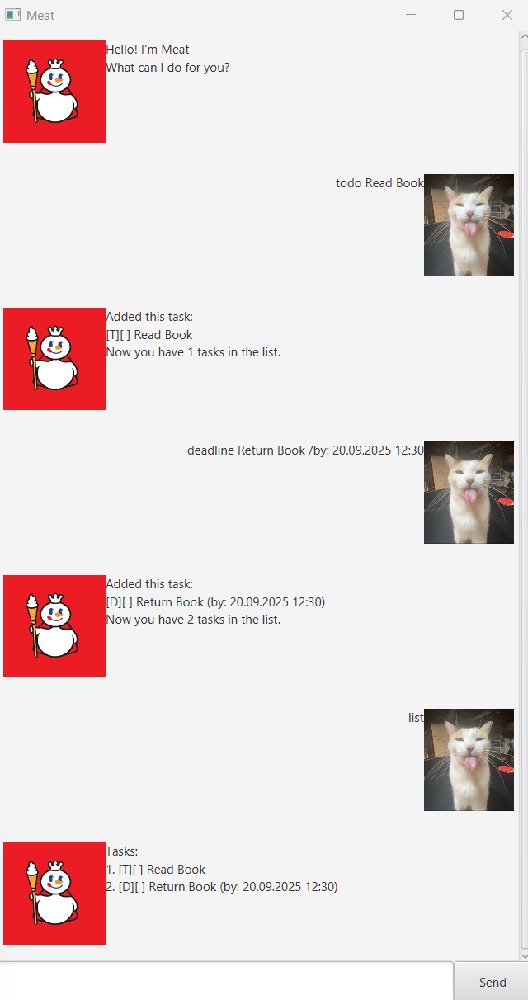

# Meat User Guide

Meet **Meat**, a chatbot that chops up your tasks into bite-sized pieces and serves them to you :)

**Meat** is a simple chatbot designed to help you manage tasks efficiently. You can add different types of tasks, mark them as done, search for tasks, and get your daily schedule.

---

## Adding Todos

Add a task without a specific date/time.

**Command syntax:**  
todo taskname

**Example:**  
todo Read book

**Expected outcome:**  
Added this task:  
[T][ ] Read book  
Now you have 1 tasks in the list.

---

## Adding Deadlines

Add a deadline with a due date/time.

**Command syntax:**  
deadline taskname <description> /by: DD.MM.YYYY hh:mm

**Example:**  
deadline Submit report /by: 18.09.2025 17:00

**Expected outcome:**  
Added this task:  
[D][ ] Submit report (by: 18.09.2025 17:00)  
Now you have 2 tasks in the list.

---

## Adding Events

Add an event with a start and end time.

**Command syntax:**  
event taskname /from: DD.MM.YYYY hh:mm /to: DD.MM.YYYY hh:mm

**Example:**  
event Team meeting /from: 18.09.2025 09:00 /to: 18.09.2025 11:00

**Expected outcome:**  
Added this task:  
[E][ ] Team meeting (from: 18.09.2025 09:00 to: 18.09.2025 11:00)  
Now you have 3 tasks in the list.

---

## Listing Tasks

View all tasks currently in your list.

**Command syntax:**  
list

**Expected outcome:**  
Tasks:

[T][ ] Read book

[D][ ] Submit report (by: 18.09.2025 17:00)

[E][ ] Team meeting (from: 18.09.2025 09:00 to: 18.09.2025 11:00)

---

## Marking and Unmarking Tasks

Mark a task as done, or not done yet.

**Command syntax:**  
mark tasknumber

**Example:**  
mark 2

**Expected outcome:**  
Marked this task as done:  
[D][X] Submit report (by: 18.09.2025 17:00)

**Command syntax:**  
unmark tasknumber

**Example:**  
unmark 2

**Expected outcome:**  
Marked this task as done:  
[D][ ] Submit report (by: 18.09.2025 17:00)

---

## Deleting Tasks

Remove a task from the list.

**Command syntax:**  
delete tasknumber

**Example:**  
delete 1

**Expected outcome:**  
Got it. I've removed this task:  
[T][ ] Read book  
Now you have 2 tasks in the list.

---

## Finding Tasks by Keyword

Search tasks by a keyword.

**Command syntax:**  
find keyword

**Example:**  
find report

**Expected outcome:**  
Here are the matching tasks in your list:

[D][X] Submit report (by: 18.09.2025 17:00)

---

## Scheduling by Date

View all tasks for a particular day.

**Command syntax:**  
schedule DD.MM.YYYY

**Example:**  
schedule 18.09.2025

**Expected outcome:**  
Here's your schedule for 18.09.2025:

[E][ ] Team meeting (from: 18.09.2025 09:00 to: 18.09.2025 11:00)

[D][ ] Submit report (by: 18.09.2025 17:00)

---

## Exiting Meat

Closes the window.

**Command Syntax:**   
bye

---

## List of Commands

- `list` – Show all tasks
- `mark <task number>` – Mark a task as done
- `unmark <task number>` – Mark a task as not done
- `delete <task number>` – Delete a task
- `todo <task name>` – Add a todo
- `deadline <task name> /by: DD.MM.YYYY hh:mm` – Add a deadline
- `event <task name> /from: DD.MM.YYYY hh:mm /to: DD.MM.YYYY hh:mm` – Add an event
- `find <keyword>` – Search tasks by keyword
- `schedule DD.MM.YYYY` – Show tasks for a date
- `bye` – Exit Meat  